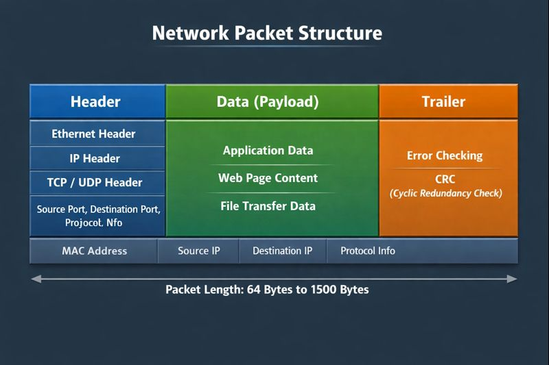

# What is a Packet?

**Definition:**
A packet is a small unit of data that is transmitted over a network. Networks do not send complete files or messages at once. Instead, data is divided into many small packets, sent separately, and reassembled at the destination.

**Why Packets Are Used:**
- Efficient data transmission
- Faster communication
- Only lost packets are retransmitted
- Multiple users can share the same network

**Packet Structure:**
A packet consists of three main parts:

> **Note:** Don't get overwhelmed by the details shown in the diagram above. The various fields and technical terms will be explained in further chapters. For now, just understand the three main components.

1. **Header**
   - Source IP address
   - Destination IP address
   - Sequence number
   - Protocol information (TCP or UDP)

2. **Payload**
   - Actual data (part of a file, message, video, etc.)

3. **Trailer**
   - Error detection information (checksum)

**Packet Characteristics:**
- Packets may travel through different paths
- Packets may arrive out of order
- Packets can be lost
- TCP ensures retransmission and correct ordering
